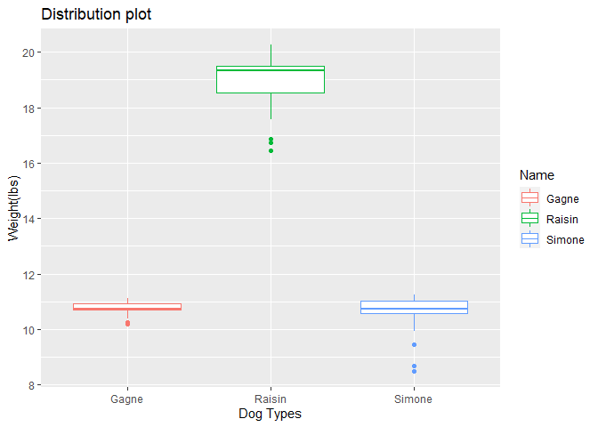
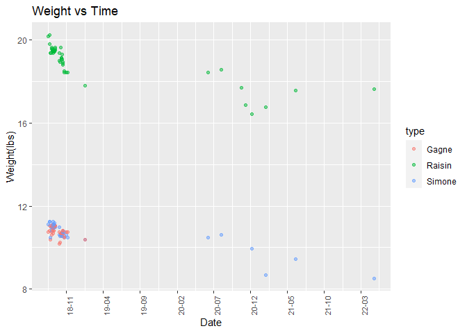
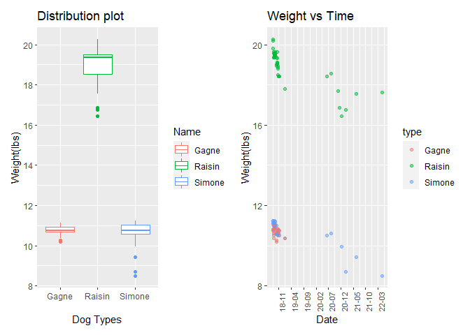

p8105_mtp_wm2473
================
2022-10-21

# Importing the library

``` r
library(tidyverse)
```

    ## ── Attaching packages ─────────────────────────────────────── tidyverse 1.3.2 ──
    ## ✔ ggplot2 3.3.6      ✔ purrr   0.3.4 
    ## ✔ tibble  3.1.8      ✔ dplyr   1.0.10
    ## ✔ tidyr   1.2.0      ✔ stringr 1.4.1 
    ## ✔ readr   2.1.2      ✔ forcats 0.5.2 
    ## ── Conflicts ────────────────────────────────────────── tidyverse_conflicts() ──
    ## ✖ dplyr::filter() masks stats::filter()
    ## ✖ dplyr::lag()    masks stats::lag()

``` r
library(readxl)
library(lubridate)
```

    ## 
    ## 载入程辑包：'lubridate'
    ## 
    ## The following objects are masked from 'package:base':
    ## 
    ##     date, intersect, setdiff, union

``` r
library(patchwork)
library(ggridges)
```

\#Counting words

``` r
wordcountaddin::text_stats("p8105_mtp_wm2473.Rmd")
```

    ## For information on available language packages for 'koRpus', run
    ## 
    ##   available.koRpus.lang()
    ## 
    ## and see ?install.koRpus.lang()

    ## 
    ## 载入程辑包：'koRpus'

    ## The following object is masked from 'package:readr':
    ## 
    ##     tokenize

| Method          | koRpus      | stringi       |
|:----------------|:------------|:--------------|
| Word count      | 43          | 40            |
| Character count | 277         | 277           |
| Sentence count  | 2           | Not available |
| Reading time    | 0.2 minutes | 0.2 minutes   |

\#Problem 1

``` r
# The raw data contain weights of three types of dogs. My goal is make the data more reasonable and readable for analysis by tidy and to clean the weight data and making some plots to see the realtionship of the weights and dog types. 

dog =   read_excel("./data/dogweights_07may2022.xlsx") %>% 
 janitor::clean_names() %>%  
  setNames(c("Date", "Raisin","Simone","Gagne","std", "notes")) %>% 
    filter(Date != "DATE") %>% 
  select(-notes) %>% 
  pivot_longer(Raisin: Gagne, names_to = "type", values_to = "weight") %>%
  separate(weight, into = c("lbs", "oz"), sep = " ") %>%
  mutate(Date= as.Date('1899-12-30') + days(Date), weights_lbs = as.numeric(lbs) + as.numeric(oz)/16) %>% 
  na.omit()
```

    ## New names:
    ## • `` -> `...2`
    ## • `` -> `...3`
    ## • `` -> `...4`
    ## • `` -> `...5`

``` r
dog
```

    ## # A tibble: 126 × 6
    ##    Date       std     type   lbs   oz    weights_lbs
    ##    <date>     <chr>   <chr>  <chr> <chr>       <dbl>
    ##  1 2018-08-19 20 15.8 Raisin 20    03           20.2
    ##  2 2018-08-19 20 15.8 Simone 11    02           11.1
    ##  3 2018-08-19 20 15.8 Gagne  10    12           10.8
    ##  4 2018-08-22 20 15.6 Raisin 20    04           20.2
    ##  5 2018-08-22 20 15.6 Simone 11    04           11.2
    ##  6 2018-08-22 20 15.6 Gagne  10    13           10.8
    ##  7 2018-08-24 20 15.6 Raisin 19    13           19.8
    ##  8 2018-08-24 20 15.6 Simone 11    04           11.2
    ##  9 2018-08-24 20 15.6 Gagne  11    01           11.1
    ## 10 2018-08-27 20 15.6 Raisin 19    06           19.4
    ## # … with 116 more rows

``` r
# After import data, I found that the columns name represents the dog types is messy. So I rename all the columns according to their original names. And I found that the weight column containing two units. I separate them into "lbs" and "oz", then combining them into the weights_lbs as total weight. The date column is the number from excel and I convert them into date based on the windows stating date. Finally I dropped NA value from the data set and remove the note column for the next question.  
```

# notes dataframe(second)

``` r
notes_df = 
  read_excel("./data/dogweights_07may2022.xlsx") %>% 
   janitor::clean_names() %>%  
  setNames(c("Date", "Raisin","Simone","Gagne","std", "notes")) %>% 
    filter(Date != "DATE") %>%
  mutate(Date= as.Date('1899-12-30') + days(Date)) %>% 
  select(Date, notes) %>% 
  drop_na(notes)
```

    ## New names:
    ## • `` -> `...2`
    ## • `` -> `...3`
    ## • `` -> `...4`
    ## • `` -> `...5`

``` r
notes_df
```

    ## # A tibble: 26 × 2
    ##    Date       notes                                                             
    ##    <date>     <chr>                                                             
    ##  1 2018-08-27 Right after leaving for 3 days at Weber's                         
    ##  2 2018-09-04 at camp bow wow                                                   
    ##  3 2018-10-01 dogs at Webers from Sept 18-30                                    
    ##  4 2018-10-09 dogs at Webers from Oct 5-8                                       
    ##  5 2018-10-16 on 10/15 all had hair cuts                                        
    ##  6 2018-10-22 dogs at Webers from Oct 18-22                                     
    ##  7 2018-11-18 dogs at Webers from Nov 10-17                                     
    ##  8 2019-01-08 Simone/Gagne  at Webers from Dec 20-Jan 4, Raisin at PC Dec 20-Ja…
    ##  9 2019-09-06 Gagne died 9/8/2019                                               
    ## 10 2019-11-04 on vacation? Dogs at kennel?                                      
    ## # … with 16 more rows

\#Export both dataframes as CSVs; store in the same dog directory as the
raw data

``` r
write.csv(dog,"./data/dog_weights_df.csv")
write.csv(notes_df,"./data/notes_df.csv")
```

# Problem 2

``` r
ncol(dog)
```

    ## [1] 6

``` r
names(dog)
```

    ## [1] "Date"        "std"         "type"        "lbs"         "oz"         
    ## [6] "weights_lbs"

``` r
nrow(dog)
```

    ## [1] 126

``` r
# The resulting tidy weights dataset contains 6 variables the name of them are "Date", "std", "type", "lbs", "oz", "weight_lbs" and conatins 126 observations. 
```

# Summary table: containing average and standard deviation of weights

``` r
dog %>%
  group_by(type) %>%
  summarize(num_obs = n(),
            avg_weight = mean(weights_lbs, na.rm = TRUE),
            std_weight = sd(weights_lbs, na.rm = TRUE),
           .groups = 'drop') %>%
    knitr::kable(digits = 2)
```

| type   | num_obs | avg_weight | std_weight |
|:-------|--------:|-----------:|-----------:|
| Gagne  |      37 |      10.76 |       0.23 |
| Raisin |      46 |      18.95 |       0.86 |
| Simone |      43 |      10.68 |       0.58 |

# Problem 3

``` r
# weights distribution of each dog
weightsplot = 
  dog %>%
  arrange(weights_lbs, type) %>% 
  ggplot(aes(x = type, y = weights_lbs, color = type)) +
  geom_boxplot() +
  labs(
    title = "Distribution plot",
    x = "Dog Types",
    y = "Weight(lbs)"
  )+ scale_y_continuous(breaks = c(8,10,12,14,16,18,20))+ scale_color_hue(name = "Name")

weightsplot
```

<!-- -->

# dog’s weight vs time

``` r
wt = 
  dog %>%
  arrange(weights_lbs, Date) %>% 
  ggplot(aes(x = Date, y = weights_lbs, color = type)) + geom_point(alpha = .5,scale =5)+ labs(
    title = "Weight vs Time",
    x = "Date",
    y = "Weight(lbs)"
  ) +scale_x_continuous()+  scale_x_date(
    date_breaks = "5 months",
    date_labels = "%y-%m")+
  theme(axis.text.x = element_text(size = 8, angle = 90, hjust = 0))
```

    ## Scale for 'x' is already present. Adding another scale for 'x', which will
    ## replace the existing scale.

``` r
wt
```

<!-- -->

``` r
weightsplot+wt
```

<!-- -->

``` r
# The left "weightsplot" I use the box plot to show the distribution. We can see the Raisin has the heaviest weights compared to Gagne and Simone. And Gagne and Simone has a similar dog weights. The right "wt" shows the dog's weight over time. The weight of Gagne didn't change too much and keep stable of most of the time. Gagne has a stable weight at the beggining but after Nov 2018, its weight dropped consistenly. And there is no record from Sep 2019, from the notes we can know gagne die in 09/08/2019.Both Raisin and Simone has a weight declined over the three years period. Raisin keep decreasing weight then has a slightly increase but in 12/2020, its weight reach a minimum point. After it, slightly increase again. And Simone is the lightest dog and has a similar trend of Raisin. The weight stabilized at the beginning but start decrease around 07/2020. 03/2021 has a slightly increase then drop to the lowest point at 04/2022. 
```

``` r
ggsave("./results/weightsplot.pdf", weightsplot, width = 8, height = 5)
ggsave("./results/weightvstime.pdf", wt, width = 8, height = 5)
ggsave("./results/two_panel_plot.pdf", weightsplot+wt, width = 8, height = 5)
```
